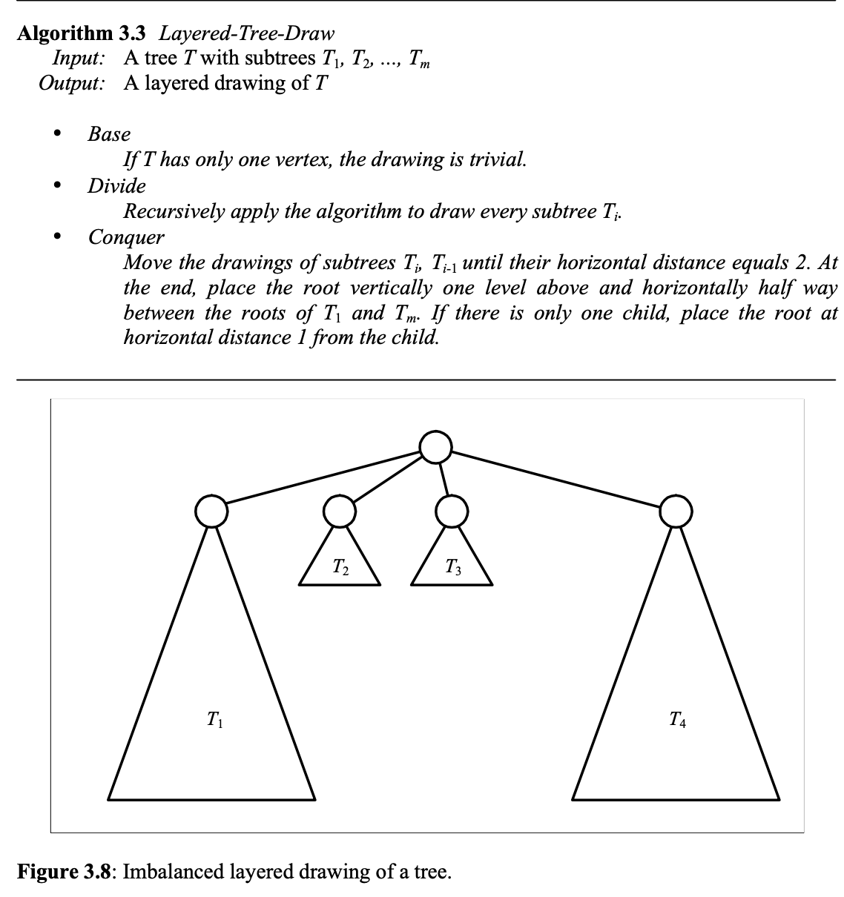

# Algorithms of data visualization

## Content

1. [Tree visualization](##Tree-visualization)
2. [DAG visualization](##DAG-visualization)
3. [Labels placement problem](##Labels-placement-problem)
4. [t-SNE](##t-SNE)

## Tree visualization

You can find out code and examples in colab notebook.

We use `Layered-Tree-Draw` algorithm to visualize our trees. You can see its pseudocode on the sreenshot below.

  
Algorithm

This screenshot was taken from this [doc](https://www.csd.uoc.gr/~hy583/papers/ch8.pdf) where you can find some more interesting algorithms of tree visualization.

In our implementation we use [matplotlib](https://matplotlib.org/) for visualization and also [networkx](https://networkx.org/) lib for loading and parsing graphs in [GraphML](https://en.wikipedia.org/wiki/GraphML) format.

## DAG visualization

You can find out code and examples in colab notebook.

There are two algorithms implemented for DAG visualization:

* _Coffman-Graham algorithm_ for DAG visualization with `max_width`
* Algorithm for minimizing dummy vertecies

Also algorithm for minimizing crossings count executes after layout algorithm for minimizing dummy vertecies.

## Labels placement problem

You can find out code and examples in colab notebook.

### Algorithm and lables placement logic

We get all possible variants of label placements for each point and corresponding bound rectagles.
After that we consider each rectangle and corresponding clauses on positions surrounding rectangles.
These clauses in fact are implications. For example, rectangle with `id = 1` can not be placed with rectangle
with `id = 2`, so it means implication: `x_1 -> not(x_2)`. In this way we compute all clauses and convert them to
SAT problem (`x_1 -> x_2 => not(x_1) or x_2`). We try to solve this problem with SAT-solver. If solution exists, we get
filtered list of rectangles which we can draw.

### Materials and links

* [PySAT](https://pysathq.github.io/index.html) python SAT solver lib
* [2-SAT](https://en.wikipedia.org/wiki/2-satisfiability) problem solution
* [Boolean satisfiability problem](https://en.wikipedia.org/wiki/Boolean_satisfiability_problem)

## t-SNE

You can find out code and examples in colab notebook.

### Materials and links

* [Paper](https://www.jmlr.org/papers/volume9/vandermaaten08a/vandermaaten08a.pdf) t-SNE implementation
* [How to use t-SNE effectively](https://distill.pub/2016/misread-tsne/)
* [MNIST dataset](http://yann.lecun.com/exdb/mnist/)
* [Binary search](https://en.wikipedia.org/wiki/Binary_search_algorithm)
